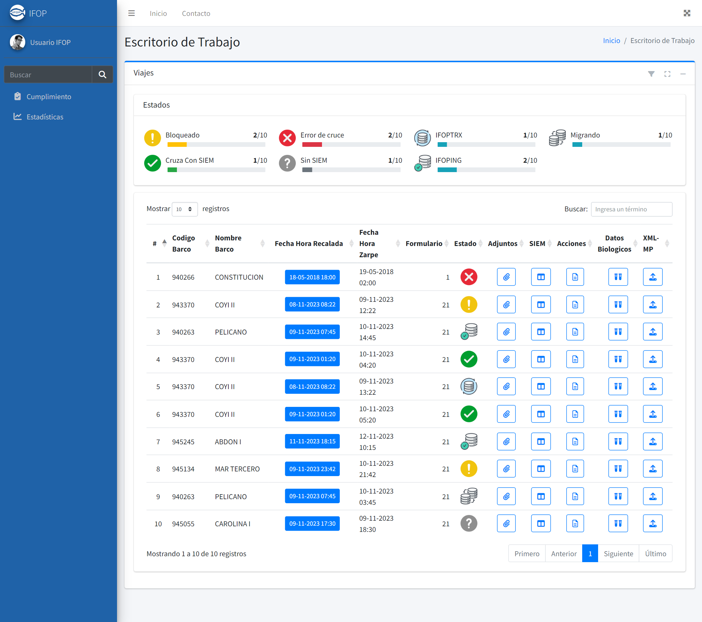
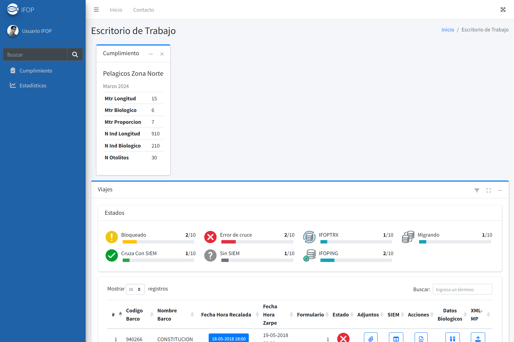
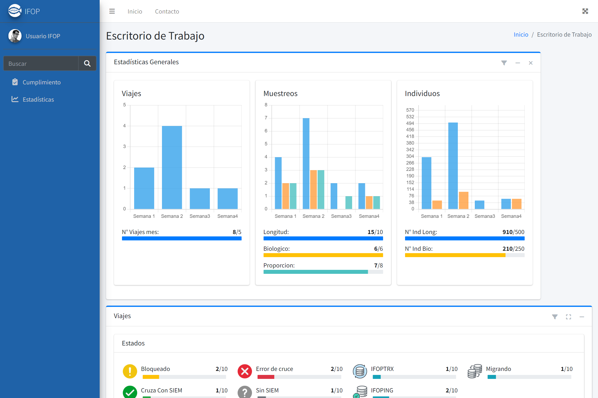
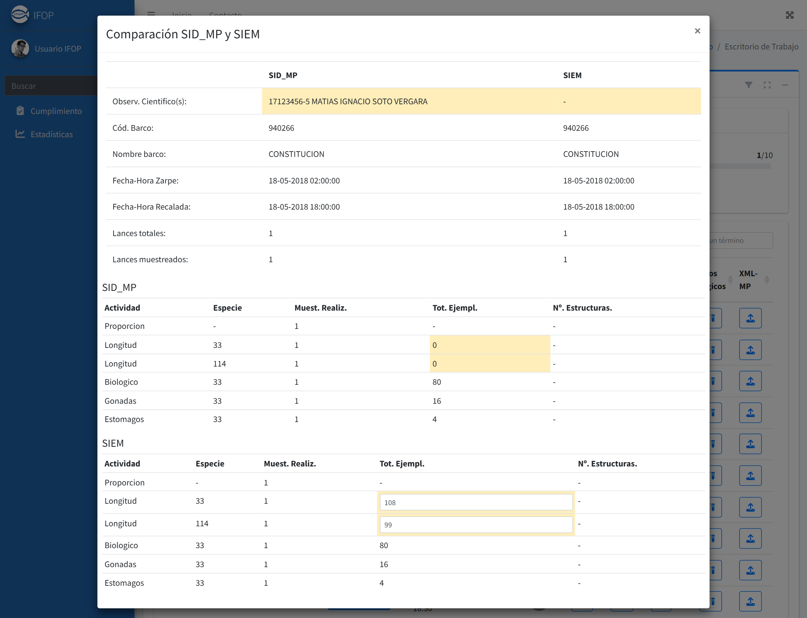
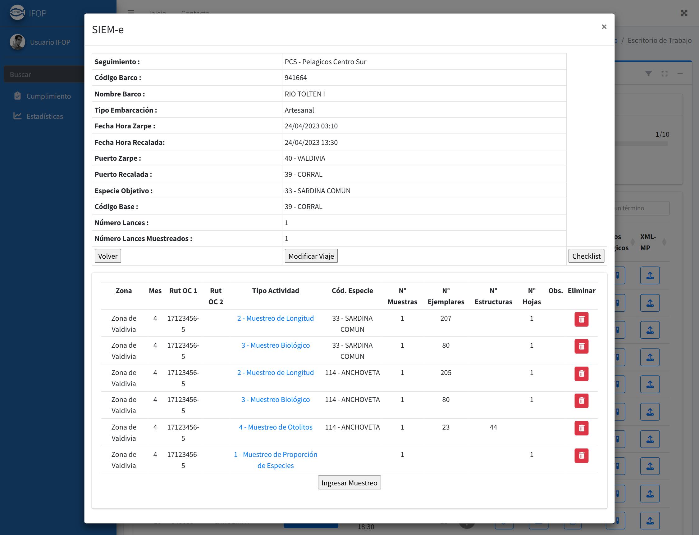
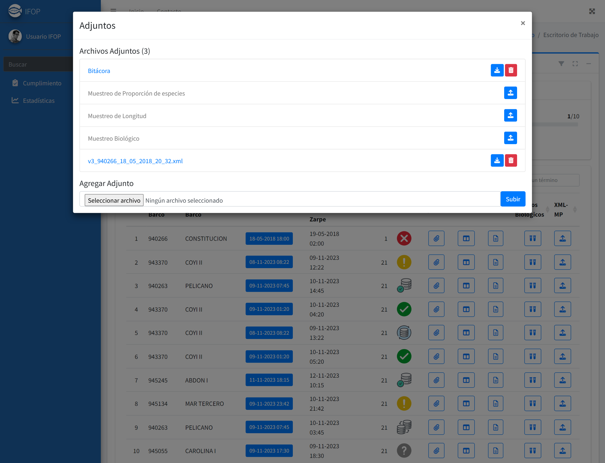
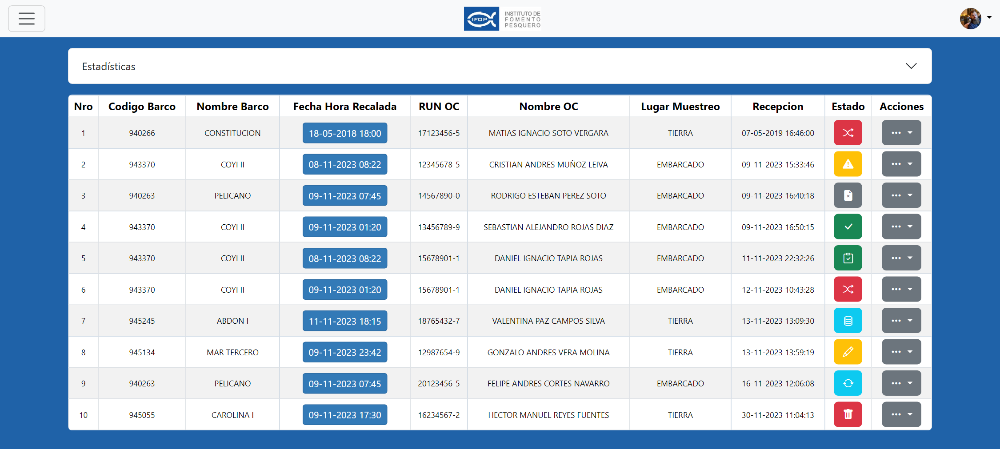
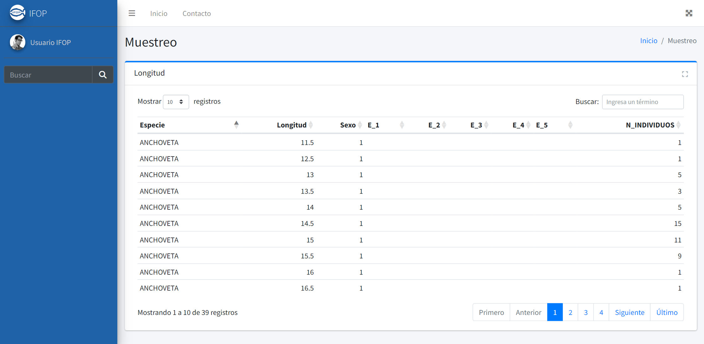

# IFOP · Escritorio de Trabajo

Prototipo funcional de una interfaz unificada para la gestión de **viajes de investigación**, **cumplimiento normativo**, **estadísticas de muestreo** y **cruce de datos con el SIEM** del Instituto de Fomento Pesquero.



## Contexto

El sistema interno estaba compuesto por múltiples aplicaciones con funcionalidad duplicada y superpuesta: la misma información se consultaba en distintos lugares, con vistas inconsistentes entre sí y sin un punto de entrada común.

Este prototipo propone un **Escritorio de Trabajo** único que reúne en una sola interfaz los flujos que antes estaban repartidos: viajes, cumplimiento, estadísticas, adjuntos, bitácora y carga de XML.

Es un **prototipo de UX/UI**, no código de producción: su objetivo fue validar la propuesta de interfaz con los usuarios antes de comprometer una implementación.

## Glosario

El sistema trabaja con vocabulario propio del área, así que conviene tenerlo a mano para leer las capturas:

| Sigla | Significado |
| --- | --- |
| **IFOP** | Instituto de Fomento Pesquero |
| **SIEM** | El sistema externo contra el que se cruzan los datos de muestreo |
| **SID_MP** | El sistema interno de gestión de muestreo, origen del cruce |
| **OC** | Observador Científico: quien toma los datos a bordo |
| **CC** | Coordinador de Campo |
| **CG** | Coordinador General |
| **DGM** | Departamento de Gestión de Muestreo |
| **Bitácora** | El registro de lo ocurrido durante un lance o un viaje |

## Capturas

### Grilla de viajes

Listado de viajes con estado por registro, filtros por base de datos, barco, lugar de muestreo y rango de fechas, y acciones por fila.

El estado se comunica con un set de iconos propio en lugar de texto, porque es el dato que el usuario necesita reconocer de un vistazo:

| Icono | Estado | Icono | Estado |
| --- | --- | --- | --- |
|  | Error de cruce |  | Cruza con SIEM |
|  | Bloqueado |  | Sin SIEM |
|  | IFOPTRX |  | IFOPING |
|  | Migrando | | |

### Cumplimiento

Metas de muestreo del período, con lo realizado contra lo comprometido.



### Estadísticas

Viajes muestreados, muestreos por tipo e individuos, agregados por semana.



### Cruce SID_MP vs SIEM

La comparación entre el sistema interno (SID_MP) y el SIEM, con las diferencias resaltadas. Este es el núcleo del problema: detectar dónde no coinciden las dos fuentes.



### SIEM y adjuntos del viaje





### Visualizador de perfil

Vista de los viajes asociados a un observador científico, con sus datos de recalada, recepción y estado.



### Planillas de extracción

Las planillas de muestreo (longitud, biológico, proporción, bitácora de captura) se construyen leyendo el **XML de la extracción** del viaje: el archivo se parsea y se vuelca a una grilla.



## Cómo levantarlo

El prototipo necesita servirse por HTTP: las vistas y los datos se cargan con `fetch`, así que abrir `index.html` con doble clic no funciona.

```bash
python server.py
```

Luego abre <http://localhost:8080>.

En Windows también puedes usar `lanzar.bat`, que hace lo mismo.

## Estructura

```
index.html                    Escritorio de Trabajo (vista principal)
visualizador_perfil_CC.html   Visualizadores de perfil por rol: coordinador de
visualizador_perfil_CG.html   campo (CC), coordinador general (CG) y observador
visualizador_perfil_OC.html   científico (OC). Cada uno lista los viajes del perfil.
server.py                     Servidor local de desarrollo
scripts/                      Lógica de cada vista y de cada modal
templates/                    Fragmentos que se cargan dinámicamente
  extraccion/                 Planillas de muestreo leídas desde el XML
adjuntos/                     Documentos de ejemplo (PDF, XML, imagen)
assets/                       Logo e iconos de estado
capturas/                     Capturas para este README
```

## Tecnología

La interfaz se construyó sobre **AdminLTE 3** (Bootstrap 4 + jQuery), con **DataTables** para las grillas, **Chart.js** para los gráficos, **Leaflet** para la geografía y **pdf.js** / **CodeMirror** para la previsualización de adjuntos.

La elección responde al objetivo del prototipo: validar la interfaz y los flujos con los usuarios en el menor tiempo posible, reutilizando componentes ya conocidos por el equipo. Para una implementación en producción la propuesta apunta a un stack con componentes reutilizables y estado tipado.

## Datos

**Todos los datos de este prototipo son ficticios.** Los nombres, RUN y usuarios que aparecen en las vistas fueron reemplazados por identidades inventadas, y los documentos de `adjuntos/` están redactados o son de ejemplo. Se usan para probar la carga de documentos y el parseo del XML de extracciones de muestreo.

## Trabajo pendiente

- El prototipo no tiene backend: los datos de la grilla de viajes están en el propio JavaScript y el XML se lee de un archivo local.

## Autor

**Diego** — Ingeniería de Ejecución en Informática, Pontificia Universidad Católica de Valparaíso.

Prototipo desarrollado durante la práctica profesional en el Instituto de Fomento Pesquero.
